# 設計書: 能登半島地震 垂直写真 → ODM → DSM タイル

作成: 2026-09-18 / 状態: **Phase 1 完了**（2026-09-18, 結果は [results-suzu_0102.md](results-suzu_0102.md)）

## 1. 目的

国土地理院が公開している令和6年能登半島地震の**垂直写真（単写真）**を入力に、OpenDroneMap（ODM）で
DSM と正射画像を生成し、DSM を**地理院標高タイル形式の PNG タイル**にして、
地理院公式の SfM DSM（`20240102noto_1mDSM`）と同じビューア上で比較できる状態にする。

- 地理院が災害直後に行った「空中写真 → SfM → DSM」を、公開データと OSS だけで再現する
- 地理院 DSM との差（範囲・分解能・高さの偏差）を定量的に把握する
- 手順をスクリプト化し、他地区・他日・他災害に横展開できる形にする

## 2. スコープ

| | 含む | 含まない |
|---|---|---|
| 入力 | 地理院公開の垂直写真 qv 版（3648×6432） | 原寸写真（未公開）、閲覧サービスの有償高解像度 |
| 処理 | ODM による SfM/MVS、DSM、正射画像 | 手動 GCP 測設（Phase 2 で検討）、点群の検証・配信（中間生成物 LAZ は出力のみ） |
| 出力 | DSM GeoTIFF、地理院標高タイル PNG、比較用 MapLibre ビューア | 3D Tiles 配信（後続で検討） |
| 対象 | **Phase 1: 珠洲 1/2 撮影（133枚, DMC）**。Phase 2 以降で他地区 | 4月撮影分（正射画像のみ公開、単写真なし） |

### パイロットを珠洲 1/2 にする理由

- 単一日・単一カメラ（DMC）で構成が均質（Qiita 記事の「年度を混ぜない」教訓）
- 133枚・約230MB とサイズが手頃で、GPU 1枚で数十分〜1時間台の見込み
- 珠洲は隆起・津波・家屋倒壊が混在し、地理院 1mDSM との比較で違いが出やすい
- 主点間隔約1050m・7コースで、SfM に必要なオーバーラップが確認済み（notes.md §7）

## 3. 入力データ

### 3.1 垂直写真メタデータ（地理院地図 GeoJSON）

```
https://maps.gsi.go.jp/xyz/20240102noto_<district>_<MMDD>suichoku/2/3/1.geojson
```

- 1フィーチャ = 1枚。Point（主点の経緯度, WGS84）
- プロパティ: `name`(地区), `コース番号`, `写真番号`, `画像`(HTML; 中に JPEG 直リンク), `撮影日`
- 地区名の綴り: レイヤ id は `wazima*`、タイル URL は `wajima*`（`wazimanishii`→`wajimanishi`）
- ここから取り出すもの: **写真URL, 主点 lon/lat, コース, 写真番号, 撮影時刻**

### 3.2 写真本体

```
https://saigai.gsi.go.jp/1/R6_0101notohanto/<MMDD><district>_<camera>/photo/qv/<NNNN>.jpg
```

| 項目 | 値（珠洲 1/2 実測） |
|---|---|
| 画素数 | 3648 × 6432 px（**長辺 = 進行方向と直交**。コース間隔 3150 m・主点間隔 1008 m が、25728 px を across-track にした場合のみ側方 30%・前後 60% の標準オーバーラップと整合。ビューアの回転角 269° = 進行方位 + 90° も同じことを示す） |
| ファイル | JPEG RGB, 平均約 5.1 MB（133枚で 681 MB）, **EXIF なし** |
| 元カメラ | Leica DMC III（原寸 14592×25728, 画素 3.9µm, 焦点距離 92mm）の 1/4 縮小 |
| 実効 GSD | ≈ 0.70 m/px（原寸 GSD 0.175 m。コース間隔から逆算、§5.3） |
| 主点間隔 | 約1008 m（同一コース, 中央値）→ 前後オーバーラップ約 60%。コース間隔 約3148 m → 側方約 30% |
| 撮影範囲 | lon 137.164〜137.378, lat 37.363〜37.558 |

対地高度は推定値 ≈4120 m（側方 30% 仮定）。撮影時刻は 10:33〜11:22 JST で、写真番号の順序は時刻順と逆のコースがある（進行方位は時刻順で計算する）。

### 3.3 比較・検証用（正解側）

| データ | URL | 用途 |
|---|---|---|
| 地理院 SfM DSM 1m | `https://maps.gsi.go.jp/xyz/20240102noto_1mDSM/{z}/{x}/{y}.png` | DSM の直接比較 |
| 地理院 正射画像 1/2 珠洲 | `https://maps.gsi.go.jp/xyz/20240102noto_suzu_0102do/{z}/{x}/{y}.png` (z10–18) | 位置ずれ・オルソ品質の比較 |
| 基盤地図情報 DEM5A/B | 地理院標高タイル `dem5a_png` 等 | 地震前の地盤高（変化のない場所での鉛直精度確認） |

## 4. 処理環境

- Windows 11 / Ryzen 7 5700X (16T) / RAM 64GB / RTX 4060 8GB / Docker Desktop (WSL2)
- ODM: `opendronemap/odm:gpu`（バージョンは初回 pull 時に `docker image inspect` で記録し、README に固定値を書く）
- `.wslconfig` に `memory=48GB`, `processors=14`, `swap=16GB` を設定してから実行
- Python 3.12（ダウンローダ・タイル変換）: requests, Pillow, piexif, numpy, GDAL（OSGeo4W or conda）

## 5. 処理フロー

珠洲 1/2（`suzu_0102`）で実際に走らせた内容を、入出力・パラメータ・所要時間・つまずきと対処まで 1 枚にまとめた図。
各ステップの詳細は §5.1〜5.6。数値は 2026-09-18 の実行値（[results-suzu_0102.md](results-suzu_0102.md)）。

```mermaid
flowchart TD
  %% ───────────── 入力（国土地理院 公開データ） ─────────────
  subgraph GSI["国土地理院 公開データ（入力・比較用）"]
    direction LR
    GJ["地理院地図 垂直写真レイヤ GeoJSON<br/>maps.gsi.go.jp/xyz/20240102noto_suzu_0102suichoku/2/3/1.geojson<br/>1 フィーチャ = 1 枚: 主点経緯度・コース番号・写真番号・撮影時刻・写真 URL（HTML 内）<br/>高度は無い"]
    JPG["垂直写真（単写真）qv JPEG ×133<br/>saigai.gsi.go.jp/1/R6_0101notohanto/0102suzu_DMC/photo/qv/NNNN.jpg<br/>3648×6432 px, 平均 5.1 MB, EXIF なし（GPS・焦点距離とも無い）<br/>Leica DMC III 原寸の 1/4 縮小"]
    REF["地理院 SfM 1mDSM（正解側）<br/>maps.gsi.go.jp/xyz/20240102noto_1mDSM/{z}/{x}/{y}.png<br/>地理院標高タイル PNG, 配信は z15 まで"]
    ORTHO_GSI["地理院 正射画像 珠洲 1/2<br/>maps.gsi.go.jp/xyz/20240102noto_suzu_0102do (z10–18)<br/>ビューアで重畳のみ"]
  end

  %% ───────────── [A] ─────────────
  subgraph A["[A] 01_fetch_metadata.py  — 数秒"]
    A1["GeoJSON を 1 回取得<br/>画像プロパティの HTML から index_dmc.html?PATH&amp;DEGdeg を正規表現で抜く<br/>→ 写真 URL = saigai.gsi.go.jp/1/PATH, 回転角 DEG"]
    A2["datasets/suzu_0102/photos.csv（133 行）<br/>file=C01_0001.jpg, url, lon, lat, course, photo_no, shot_time(ISO+09:00), rotation_deg"]
    A3["幾何統計をログ出力<br/>コース内 主点間隔 中央値 1008 m / 隣接コース間隔 3148 m<br/>撮影 10:33–11:22 JST, 7 コース<br/>→ 写真番号順 ≠ 時刻順のコースがある（進行方位は時刻順で計算）"]
  end

  %% ───────────── [B] ─────────────
  subgraph B["[B] 02_fetch_photos.py  — 347 s"]
    B1["photos.csv の URL を 1 req/s で取得<br/>3 回リトライ・.part → rename・既存で正常な JPEG はスキップ（再開可）<br/>取得後 Pillow で 3648×6432 を検査"]
    B2["datasets/suzu_0102/raw/C01_0001.jpg …（133 枚, 681 MB）<br/>原本は以後触らない"]
  end

  %% ───────────── [C] ─────────────
  subgraph C["[C] 03_prepare_odm_inputs.py  — 約 1 分"]
    CAM["config/cameras/dmc3_qv.json<br/>f = 92 mm, 画素 3.9 µm, 原寸 25728×14592<br/>長辺 = across-track（コース間隔/主点間隔が 側方30%/前後60% と整合するのはこの向きだけ）<br/>35mm 換算 = 36 × 92 / 100.3 mm = 33 mm"]
    C1["対地高度 AGL を推定（GeoJSON に高度が無いため）<br/>across 幅 = 3148 / (1−0.30) = 4497 m → GSD = 4497 / 25728 = 0.175 m<br/>AGL = 0.175 × 92 / 0.0039 = 4123 m（前後オーバーラップ逆算 60% で整合）<br/>GPSAltitude = 地盤 100 m + 4123 = 4223 m"]
    C2["EXIF 注入（piexif, raw → images へコピー）<br/>GPSLatitude/Longitude = 主点, GPSAltitude = 4223<br/>FocalLength 92, FocalLengthIn35mmFilm 33, Make=Leica, Model=DMC III qv, DateTimeOriginal"]
    C3["datasets/suzu_0102/images/*.jpg（ODM 入力, 133 枚）"]
    C4["datasets/suzu_0102/geo.txt<br/>EPSG:4326 / 4 列: image lon lat 4222.9（yaw 等は --with-yaw で任意）"]
    C5["dataset_info.json（推定値の記録: GSD, AGL, オーバーラップ, focal35）"]
  end

  %% ───────────── [D] ─────────────
  subgraph D["[D] 04_run_odm.ps1 → docker run --gpus all opendronemap/odm:gpu（ODM 3.6.2, RTX 4060 8GB, WSL2 32 GB）"]
    D0["主要引数<br/>--geo geo.txt --gps-accuracy 30 --camera-lens brown<br/>--feature-type sift --feature-quality high --min-num-features 12000<br/>--matcher-type flann --matcher-neighbors 12<br/>--pc-quality high --dsm --dem-resolution 100 --orthophoto-resolution 100 --cog --auto-boundary"]
    D1["opensfm  9.6 分<br/>SIFT(GPU, 3216 px) 68 s → FLANN GPS 近傍 12 マッチ 54 s → 増分再構成 209 s<br/>再構成 100 / 133 枚（外れた 33 枚 = 各コース両端 + 最東端 C01 の海上写真）<br/>点 280,685 / 再投影誤差 0.54 px / 焦点比 0.9167 → 0.9106<br/>GPS 残差 x 4.4 m, y 25.1 m（コース方向）, z 4.7 m"]
    D2["openmvs 5.9 分 → filterpoints 0.8 分 → meshing 8.3 分 → texturing 13.0 分<br/>密点群 25.9 M 点"]
    D3["odm_georeferencing（UTM 53N, EPSG:32653）<br/>odm_georeferenced_model.laz 167 MB（中間生成物・検証対象外）"]
    DX["初回の失敗: --pc-classify --dtm を付けていた<br/>SMRF 地盤分類 90 分 → 地盤点 0 → renderdem が空点群から 2^31 px を割当 → exit 137<br/>dsm.tif 自体は完成済み"]
    DR["対処: --dtm --pc-classify を外し --rerun-from odm_dem<br/>（04 では -Dtm / -PcClassify スイッチ、既定オフ）"]
    D4["odm_dem/dsm.tif  2.5 分<br/>13263×13816 px @1.23 m, float32, nodata −9999, COG<br/>高さ範囲 −932 … +86 m ← 一律に低い（GPS 高度の仮定が原因）"]
    D5["odm_orthophoto/odm_orthophoto.tif  1.6 分<br/>RGBA, 1 m, COG, 330 MB"]
    D6["odm_report/report.pdf, stats.json  0.5 分"]
  end

  %% ───────────── [E] ─────────────
  subgraph E["[E] 05_dsm_to_gsi_tiles.py  — 約 10 分 / 回（rasterio + numpy）"]
    E1["dsm.tif → EPSG:3857 へ bilinear で warp（z17 解像度 1.194 m/px, 17920×18688 px）<br/>原点をタイル格子にスナップ → 256 px で切出し<br/>z16 以下は無効値を除いた 2×2 平均で縮小"]
    E2["地理院標高タイル PNG エンコード<br/>x = round(h/0.01); x&lt;0 → x+2^24; R=x>>16, G=(x>>8)&amp;255, B=x&amp;255<br/>無効 = (128,0,0)"]
    E3["output/suzu_0102/dsm_tiles/{z}/{x}/{y}.png  z10–17, 4,123 枚, 293 MB<br/>+ metadata.json（bounds, zooms, z_offset_m）"]
    EZ["--z-offset 463.67<br/>有効画素に一律加算（2 回目のみ）"]
  end

  subgraph E7["[E'] 07_ortho_to_xyz_tiles.py  — 約 10 分"]
    E71["odm_orthophoto.tif → EPSG:3857 RGBA, 同じ格子・縮小ロジック（α 重み平均）"]
    E72["output/suzu_0102/ortho_tiles/{z}/{x}/{y}.png  z10–17, 4,123 枚, 432 MB + metadata.json"]
  end

  %% ───────────── [F] ─────────────
  subgraph F["[F] 06_compare_dsm.py  — 約 1 分（214 タイル, 0.2 s 間隔, output/cache に保存）"]
    F1["自作 z15 タイルごとに同座標の 1mDSM タイルを取得・両方デコード<br/>両方有効な画素で d = 自作 − 参照（|d| クリップ）"]
    F2["1 回目（補正なし）<br/>n = 1,170 万 / 中央値 −463.67 m / 中央値除去後 RMSE 4.95 m, MAD 2.55 m<br/>タイル別中央値の平面フィット: 傾き −0.01 m/km(E), +0.33 m/km(N) → 一定オフセットと判断<br/>→ 実 AGL ≈ 4587 m, 側方オーバーラップ ≈ 37%"]
    F3["2 回目（補正後）<br/>平均 −0.07 m / RMSE 4.95 m / 5–95% ±8.1 m<br/>→ docs/results-suzu_0102-vs-20240102noto_1mDSM-z15.md（+ .hist.csv, .tiles.json）"]
  end

  %% ───────────── [G] ─────────────
  subgraph G["[G] 可視化・公開"]
    V["viewer/index.html（MapLibre GL JS 4.7）<br/>gsidem:// プロトコルで GSI PNG → Mapbox terrain-RGB に変換（負値・無効値対応）<br/>terrain: 自作 DSM / 地理院 1mDSM / なし, 陰影, 正射画像 2 種, 誇張 1.0×, クリックで z15 の両 DSM 値と差<br/>metadata.json の maxzoom を読む → ローカル(z17)と Pages(縮小)で同じ HTML"]
    P["08_publish_pages.py --push<br/>redirect + viewer + DSM z≤15 (24 MB) + 正射 z≤16 (128 MB) を<br/>orphan gh-pages ブランチとして force-push"]
    URL["https://shiwaku.github.io/odm-aerial-photo-sfm/viewer/"]
    LOCAL["ローカル確認: python -m http.server 8000 → /viewer/（z17 まで）"]
  end

  %% ───────────── エッジ ─────────────
  GJ --> A1 --> A2 --> A3
  A2 --> B1
  JPG --> B1 --> B2
  A2 --> C1
  CAM --> C1 --> C2
  B2 --> C2 --> C3
  C1 --> C4
  C1 --> C5
  C3 --> D0
  C4 --> D0
  D0 --> D1 --> D2 --> D3
  D3 -.-> DX -.-> DR --> D4
  D3 --> D4
  D4 --> D5 --> D6
  D4 -->|"1 回目: --z-offset なし"| E1 --> E2 --> E3
  E3 -->|"z15"| F1
  REF --> F1
  F1 --> F2
  F2 -->|"中央値 −463.67 m を 05 へ"| EZ --> E1
  E3 -->|"2 回目（補正後）"| F3
  D5 --> E71 --> E72
  E3 --> V
  E72 --> V
  ORTHO_GSI --> V
  REF --> V
  V --> LOCAL
  V --> P --> URL

  classDef input fill:#eef6ff,stroke:#5b8def
  classDef fail fill:#fff0f0,stroke:#d9534f
  classDef result fill:#f0fff0,stroke:#5cb85c
  class GJ,JPG,REF,ORTHO_GSI input
  class DX fail
  class F2,F3,URL result
```



読み方:

- **青 = 地理院の公開データ**。写真そのものに位置情報は無く、GeoJSON の主点座標を [C] で写真に書き込んでいる。高度だけはどこにも無いので推定値
- **赤 = 起きた失敗**。DTM 生成で落ちたが DSM は完成しており、DTM を外して DEM 段階から再開した
- **緑 = 結果**。形状は 1mDSM と RMSE 4.95 m で一致、絶対高だけ仮定高度由来の一定オフセットで、[F] → [E] のループで補正した
- 点線は初回だけ通った経路、実線ラベル付きは 2 回通る経路（05 と 06）

### 5.1 [A] メタデータ取得 `scripts/01_fetch_metadata.py`

- 引数: `--layer 20240102noto_suzu_0102suichoku`（複数可）
- `/2/3/1.geojson` を取得し、`画像` プロパティから `index_dmc.html?<path>&<deg>` の `<path>` を正規表現で抜く
  → `https://saigai.gsi.go.jp/1/<path>`
- 出力 `datasets/<proj>/photos.csv`: `file,url,lon,lat,course,photo_no,shot_time,rotation_deg`
- `rotation_deg` は地理院ビューアの回転角。実測で `rotation_deg − 進行方位 ≈ 269.4°` と一定（長辺が across-track であることの裏付け）
- 併せてコース別の主点間隔・コース間隔・bbox・撮影時刻範囲をログに出す

### 5.2 [B] 写真取得 `scripts/02_fetch_photos.py`

- photos.csv を読み、`raw/<course>_<photo_no>.jpg` として保存（例 `C01_0001.jpg`）。`images/` は 03 が EXIF 注入済みコピーを書く（03 を再実行しても原本が汚れない）
- 1リクエスト/秒、サイズ一致でスキップ、失敗は3回リトライ（再開可能）
- 取得後に Pillow でサイズ検査（3648×6432 以外を警告）
- コース間隔の算出は 01 側に置いた（座標だけで計算できる）

### 5.3 [C] 前処理 `scripts/03_prepare_odm_inputs.py`

ODM/OpenSfM は EXIF に GPS と焦点距離が無いと位置は無視・焦点距離はデフォルト比で始める。
OpenSfM の再構成を安定させるため両方与える。

**EXIF 注入（piexif）**

| タグ | 値 | 根拠 |
|---|---|---|
| GPSLatitude/Longitude | GeoJSON の主点 | 概略位置（数十m精度想定） |
| GPSAltitude | 推定対地高度 + 地盤高 | across 方向フットプリント = コース間隔 / (1 − 側方 30%) = 4497 m → GSD = 4497 / 25728 = 0.175 m → H = GSD × f / pixel ≈ **4,120 m**。前後オーバーラップの逆算が 60% になり整合。地盤高は定数 100 m（引数） |
| FocalLength | 92 mm | DMC III 公称 |
| FocalLengthIn35mmFilm | 33 mm | 焦点比 92 / 100.3(長辺センサ幅) = 0.917 → ×36 |
| Make / Model | `Leica` / `DMC III qv` | OpenSfM のカメラ ID をそろえる |
| DateTimeOriginal | 撮影時刻 | – |

**geo.txt（`--geo` で渡す）**

```
EPSG:4326
C01_0001.jpg 137.377993 37.543885 4750 0 0 0 30 50
...
```
既定は 4 列 `image lon lat alt`（水平精度は実行時の `--gps-accuracy` で一律指定）。`--with-yaw` で 9 列
`image lon lat alt yaw pitch roll horiz_acc vert_acc` を書き、yaw は時刻順の進行方位（pitch=roll=0）。効果を見て採否。
EXIF GPS と重複するが、実行時は `--geo` を正とする。

**cameras.json（任意）**: 1回目の実行で ODM が出力する `cameras.json` を保存し、2回目以降 `--cameras` で渡して
焦点距離・歪みを固定。Phase 2 で複数地区を処理するときにカメラ別（DMC / UCE / UCO）に持つ。

### 5.4 [D] ODM 実行 `scripts/04_run_odm.ps1`

```powershell
docker run -ti --rm --gpus all `
  -v C:\Users\yshiw\Documents\GIS\odm-aerial-photo-sfm\datasets:/datasets `
  opendronemap/odm:gpu --project-path /datasets suzu_0102 `
  --geo /datasets/suzu_0102/geo.txt `
  --feature-type sift --feature-quality high --min-num-features 12000 `
  --matcher-type flann --matcher-neighbors 12 `
  --camera-lens brown `
  --gps-accuracy 30 `
  --pc-quality high --pc-classify `
  --dsm --dtm --dem-resolution 100 `
  --orthophoto-resolution 100 `
  --cog --auto-boundary `
  --max-concurrency 14
```

| パラメータ | 値 | 理由 |
|---|---|---|
| `--feature-type sift` | GPU 版で高速化される特徴量 | README 記載 |
| `--min-num-features 12000` | 既定 10000 より増 | 雪・海・畑でテクスチャが乏しい |
| `--matcher-neighbors 12` | 位置情報ベースの近傍マッチ | 7コース格子飛行。全対全は不要 |
| `--gps-accuracy 30` | 30 m | 主点座標は概略、高度は推定値 |
| `--dem-resolution 100` | **cm 単位** = 1 m | 実効 GSD 0.8m から妥当。地理院 1mDSM と合わせる |
| `--orthophoto-resolution 100` | 1 m | 同上 |
| `--pc-classify --dtm` | **既定で外す** | SMRF が地盤点を返さず 90 分消費、DTM 生成が exit 137。04 では `-Dtm` / `-PcClassify` スイッチで任意 |
| `--cog` | COG 出力 | QGIS / 後処理で扱いやすい |
| `--3d-tiles` | 初回は付けない | 処理時間短縮。DSM が出てから追加実行 |
| `--time` | 使わない | 現行イメージでは無効（WARNING が出る）。所要時間はスクリプト側で計測 |

ログは `datasets/suzu_0102/odm_log.txt` へ tee し、`--time` で段階ごとの所要時間を記録する。

### 5.5 [E] 後処理 `scripts/05_dsm_to_gsi_tiles.py`

- 入力: `datasets/suzu_0102/odm_dem/dsm.tif`（ODM 出力の UTM 53N）
- `gdalwarp -t_srs EPSG:3857 -r bilinear` → 一時 GeoTIFF
- 地理院標高タイル PNG エンコード（数値標高 h → RGB）:
  - `x = round(h / 0.01)`; `x < 0` なら `x += 2^24`; `R = x>>16, G = (x>>8)&255, B = x&255`
  - 無効値は `(128, 0, 0)`
- 256px タイル、z10〜17（z17 で約1.19 m/px@赤道、lat37 では約 0.95 m/px）。z16 以下は無効値を除いた 2×2 平均で縮小
- 実装は rasterio（GDAL 3.9 同梱）で warp → numpy でエンコード。合成 DSM での往復テスト済み（負値・無効値含む）
- 出力: `output/suzu_0102/dsm_tiles/{z}/{x}/{y}.png` + `metadata.json`（範囲・ズーム・出典）
- 参考: ODM の正射画像も既存の `aerial-photo-tile-pipeline` で XYZ タイル化して重ねる

### 5.6 [F] 検証・可視化

**ビューア** `viewer/`（MapLibre GL JS、既存の noto DSM ビューアをベースに）
- terrain ソースを「自作 DSM」「地理院 1mDSM」で切替、hillshade で見比べ
- 正射画像（自作 / 地理院 `suzu_0102do`）のスワイプ

**定量比較** `scripts/06_compare_dsm.py`
- 地理院 1mDSM PNG を同ズームでデコードし、自作 DSM と画素単位で差分 → 平均・RMSE・ヒストグラム
- **1mDSM タイルは z15 まで**（珠洲上空で z16 以上は 404）。比較は z15（≈4.8 m/px）で行う
- 自作 DSM の絶対高は仮定した GPS 高度に依存するので、生の差と「中央値オフセット除去後」の両方を出す
- 地震で変化していない場所（道路・空き地）を数十点選び、DEM5A とも比較して絶対精度の目安を出す
- 結果は `docs/results-suzu_0102.md` に表と図で残す

## 6. ディレクトリ構成

```
odm-aerial-photo-sfm/
├── README.md
├── docs/
│   ├── notes.md            # 調査メモ
│   ├── design.md           # 本書
│   └── results-<proj>.md   # 実行結果・比較
├── scripts/
│   ├── 01_fetch_metadata.py
│   ├── 02_fetch_photos.py
│   ├── 03_prepare_odm_inputs.py
│   ├── 04_run_odm.ps1
│   ├── 05_dsm_to_gsi_tiles.py
│   ├── 06_compare_dsm.py
│   └── common.py           # CSV I/O・距離計算・日時パース
├── requirements.txt
├── config/
│   └── cameras/            # dmc3_qv.json, uce_qv.json ...
├── datasets/               # git 管理外
│   └── suzu_0102/
│       ├── photos.csv
│       ├── dataset_info.json   # 推定 GSD / AGL / オーバーラップ
│       ├── geo.txt
│       ├── raw/                # 取得した原本（EXIF なし）
│       ├── images/             # EXIF 注入済み（ODM 入力）
│       └── (ODM 出力: odm_dem/, odm_orthophoto/, odm_georeferencing/ ...)
├── output/                 # git 管理外（タイル）
└── viewer/
```

## 7. リスク・未確定事項

| 項目 | 影響 | 対応 |
|---|---|---|
| 対地高度・焦点比の推定が外れる | 初期再構成が歪む／スケールが狂う | **実際に起きた**: AGL 推定 4123 m に対し実際は ≈4587 m で、DSM が一律 −463.7 m。形状・スケールは無事（傾き 0.3 m/km 以下）。`05 --z-offset` で補正、次回は `03 --agl` で合わせる |
| qv 縮小で建物側面・細部が出ない | DSM がなだらかになる | 前提として受容。地理院 1mDSM も同系統の限界がある |
| 雪・海面・雲でマッチ失敗 | コース端や海側で穴 | `--min-num-features` 増、`--auto-boundary`。穴は無効値のまま出す |
| 8GB VRAM で SIFT がメモリ不足 | GPU 段で落ちる | `--feature-quality medium` にフォールバック（qv 解像度なら影響小） |
| saigai.gsi.go.jp への負荷 | 遮断リスク | 1req/s、再開可能にして一気に取り直さない |
| 4月撮影分は単写真非公開 | 地震後数ヶ月の比較不可 | スコープ外と明記 |

## 8. 完了条件（Phase 1）

- [x] 珠洲 1/2 の 133 枚が取得され、photos.csv / geo.txt が生成されている（2026-09-18）
- [x] ODM が最後まで走り、`dsm.tif` / `odm_orthophoto.tif` / `.laz` が出ている（所要時間を記録）
- [x] 地理院標高タイル PNG（z10–17）が出力され、MapLibre ビューアで 1mDSM と切替表示できる
- [x] 1mDSM との差分統計（平均・RMSE）が `docs/results-suzu_0102.md` にある（補正後 RMSE 4.95 m @z15）
- [x] README に再現手順（環境構築 → 7スクリプト）が書かれている

## 9. Phase 2 以降（メモ）

- 他地区（輪島東 1/2, 輪島西, 穴水 1/17, 七尾 1/5）を同手順で。UCE/UCO 用のカメラ定義を追加
- 同一地区の別日（珠洲 1/2 vs 1/14）で DSM 差分 → 応急復旧や余震による変化の検出を試す
- 地理院地図から GCP を数点拾って精度改善（Qiita 記事の手順）
- 3D Tiles 出力と点群配信
