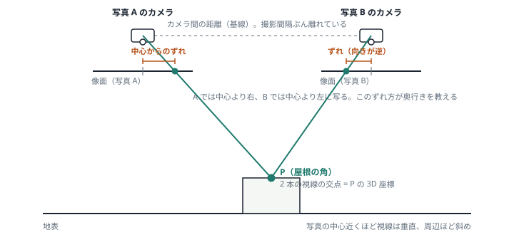
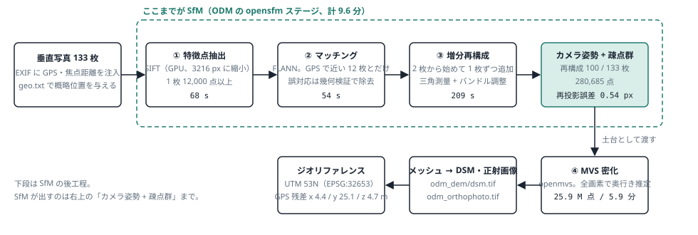
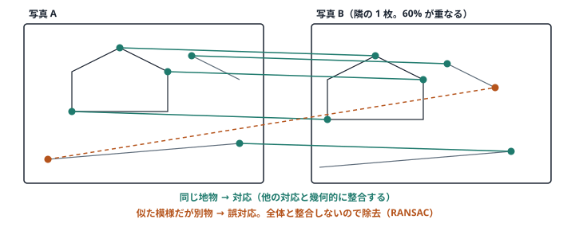
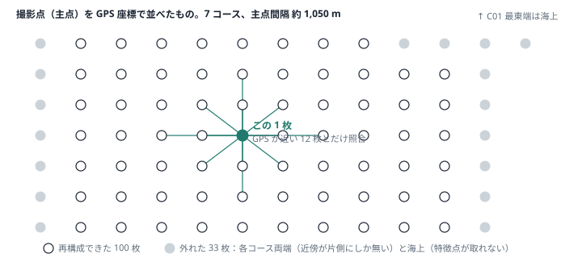
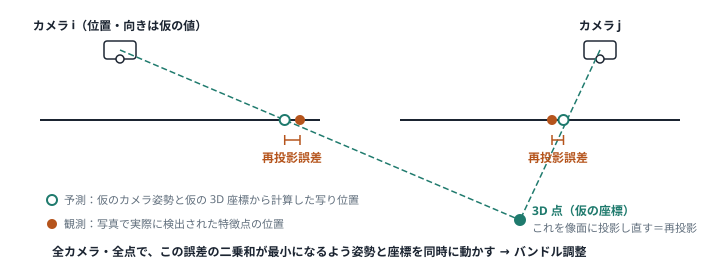
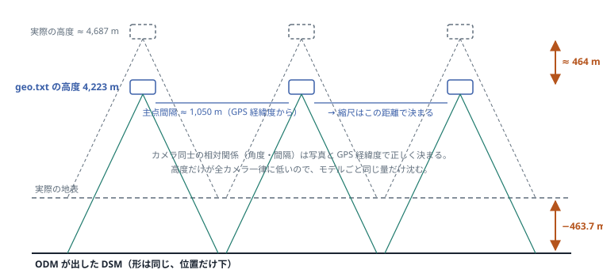

# SfM のしくみ — 写真の束から、カメラの位置と地表の形を同時に取り出す

SfM（Structure from Motion）は「同じ地物が複数の写真にどう写っているか」だけを手がかりに、
各写真を撮ったカメラの位置・向きと、地物の 3 次元座標を同時に解く手法。
ここでは珠洲 1/2（133 枚）で実際に出た数値を添えて、5 枚の図で追う。
数値の出典は [design.md §5](design.md#5-処理フロー) と [results-suzu_0102.md](results-suzu_0102.md)。

> **30 秒版**
> ① 各写真から目立つ点を拾う → ② 写真どうしで同じ点を対応付ける →
> ③ 対応点への視線が 1 か所で交わるように、カメラ位置と点の 3D 座標を一緒に微調整する →
> ④ できた「カメラ位置 + まばらな点群」を土台に、全画素で密な点群を作り DSM にする。
> ①〜③ が SfM、④ は MVS（多視点ステレオ）。

## 1. 土台：2 枚の写真に写った同じ点は、視線の交点で 3D になる

1 枚の写真では、ある画素がどの奥行きにあるかは分からない。別の場所から撮った 2 枚目に同じ点が写っていれば、
2 本の視線の交点がその点の 3D 位置になる（三角測量）。写真上での写り位置のずれが「視差」で、近いものほど大きくずれる。

2 台のカメラ位置が分かっていれば点 P の位置が求まる。逆に、P の位置が分かっていればカメラの位置が求まる。
SfM は**どちらも分からない状態から、両方を同時に**解く（§4）。

## 2. 全体の流れ：ODM の opensfm ステージで起きていること

| 工程 | ODM ステージ | 珠洲 1/2 |
|---|---|---|
| ① 特徴点抽出 | opensfm（SIFT、GPU、3216 px に縮小、1 枚 12,000 点以上） | 68 s |
| ② マッチング | opensfm（FLANN、GPS 近傍 12 枚、幾何検証で誤対応除去） | 54 s |
| ③ 増分再構成 | opensfm（2 枚から開始し 1 枚ずつ追加、三角測量 + バンドル調整） | 209 s |
| SfM の出力 | カメラ姿勢 + 疎点群 | 100 / 133 枚、280,685 点、再投影誤差 0.54 px |
| ④ MVS 密化 | openmvs（全画素で奥行き推定） | 25.9 M 点、5.9 分 |
| 後工程 | odm_filterpoints → odm_meshing → odm_dem / odm_orthophoto | DSM・正射画像 |

SfM の出力は「各写真をどこからどの向きで撮ったか」と「まばらな 3D 点」まで。
DSM の元になる密な点群は、その土台の上で MVS が作る。

## 3. ① 特徴点と ② マッチング：「どの点とどの点が同じか」を決める

特徴点とは、屋根の角や道路の白線の端のような、周囲と見分けがつく点。
SIFT は各点の周囲の模様を 128 個の数字（記述子）に変える。写真が違っても、同じ地物なら記述子はよく似るので、
写真間で記述子が近い点同士を対応付ける。

記述子が似ているだけでは誤対応が混ざる。多数の対応から「1 つのカメラ移動で説明できる組」だけを残す幾何検証（RANSAC）で
外れ値を落とす。残った対応が次の再構成の材料になる。

133 枚を全対全でマッチングすると 8,778 ペアになるが、垂直写真はどの写真がどの写真と重なるか GPS でほぼ分かる。
`--matcher-neighbors 12` は「GPS 位置が近い 12 枚とだけ照合する」指定で、約 800 ペアに絞れる。

コース端の写真は重なる相手が少なく、海面や雪は特徴点自体が拾えないため、対応点が足りずに再構成から外れる
（珠洲では 33 枚 = 各コース両端 + 最東端 C01 の海上写真）。図の撮影点配置は模式図で、実際の各コースの枚数とは一致しない。

## 4. ③ 再構成とバンドル調整：全部の視線が交わるように、全部を一度に動かす

対応点が揃ったら、まず重なりの良い 2 枚を選び、相対位置を求めて対応点を三角測量する。
そこへ 3 枚目、4 枚目と写真を 1 枚ずつ足していく（増分再構成）。足すたびに誤差が溜まるので、途中と最後に「バンドル調整」をかける。

- **予測**: 仮のカメラ姿勢と仮の 3D 座標から計算した写り位置
- **観測**: 写真で実際に検出された特徴点の位置
- **バンドル調整**: 全カメラ・全点で、この差（再投影誤差）の二乗和が最小になるよう姿勢と座標を同時に動かす

珠洲では 100 枚・280,685 点を同時に調整した結果、再投影誤差は平均 0.54 px に収まった。1 px 未満なら幾何は十分整合している。
同時に焦点距離（焦点比 0.9167 → 0.9106）やレンズ歪みも未知数として一緒に解いている。

## 5. なぜ「形」は正しいのに、高さが 463.7 m ずれたのか

写真だけから解いた SfM の結果は、形は正しくても「実世界でどこに・どの大きさで置くか」が決まらない。
それを決めるのが geo.txt に書いたカメラの GPS 座標。珠洲では経緯度は地理院の主点座標を使えたが、
高度は公開データに無く、対地高度を 4,123 m と推定して書いた。実際は約 4,587 m だった。

再構成の骨格は写真間の相対関係で決まり、GPS はそれを実座標に「置く」役目。
カメラ同士の水平間隔（主点間隔 ≈ 1,050 m）は GPS 経緯度で正しく決まるので縮尺は狂わない。
全カメラの高度が同じ量だけ間違っていると、傾きも縮尺も変わらないまま全体が平行移動する。
だから DSM は一律 −463.7 m になり、傾きは 0.3 m/km 以下に留まった。
`05 --z-offset` で戻すか、次回は `03 --agl` で正しい高度を渡せばよい。

## 6. ログの数字の読み方

| ログの値 | 意味 | 珠洲 1/2 での見立て |
|---|---|---|
| 100 / 133 枚 | バンドル調整に組み込めた写真数。外れた写真の範囲は DSM に穴になる | 外れは各コース両端と海上。対象地域はほぼ覆えている |
| 280,685 点 | SfM の疎点群。DSM の元ではなく、カメラ姿勢を決めるための「杭」 | 1 枚あたり約 2,800 点。姿勢決定には十分 |
| 再投影誤差 0.54 px | §4 の誤差の平均。写真どうしの幾何が整合しているか | 1 px 未満で良好。形の内部整合は取れている |
| 焦点比 0.9167 → 0.9106 | 与えた焦点距離を、写真から自己校正した結果 | 0.7% の補正。カメラ定義がほぼ合っていた |
| GPS 残差 y 25.1 m | SfM で決めたカメラ位置と geo.txt の GPS との差 | コース方向に大きい。主点座標の精度か撮影時刻ずれの影響。形には効かず、絶対位置に効く |
| RMSE 4.95 m @z15 | 高さオフセット補正後の地理院 1mDSM との差 | GCP なしの絶対精度。次は地理院地図から GCP を数点拾って改善（Phase 2） |

## 7. まとめ：SfM が決めるもの、GPS が決めるもの、MVS が決めるもの

- **写真どうしの対応（SfM）** が決めるのは、カメラの相対配置と地物の形。ここは GPS が無くても解ける。
- **GPS や GCP** が決めるのは、その形を実世界のどこに・どの大きさで置くか。珠洲の −463.7 m はここの入力ミス。
- **MVS** が決めるのは、SfM の骨格を土台にした密な地表面。DSM の解像度や穴はここに依存する。

この 3 層に分けて読むと、「再投影誤差は小さいのに高さがずれる」「形は良いのに端が欠ける」といった結果が矛盾なく説明できる。
